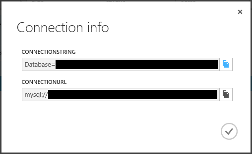

Django and MySQL on Azure
=========================

In this tutorial, we'll create a simple polls application using one of the 
PTVS sample templates.

We'll learn how to use a MySQL service hosted on Azure, how to configure the 
application to use MySQL, and how to publish the application to an Azure 
Website.

[video:"Django and MySQL on Azure" oKCApIrS0Lo 0.5]

+ [Prerequisites](#prerequisites)
+ [Create the Project](#create-the-project)
+ [Create a MySQL Database](#create-a-mysql-database)
+ [Configure the Project](#configure-the-project)
+ [Publish to an Azure Website](#publish-to-an-azure-website)


## Prerequisites

 - Visual Studio 2012 or 2013
 - [PTVS 2.1](https://pytools.codeplex.com/releases/view/109707)
 - [PTVS 2.1 Samples VSIX](https://pytools.codeplex.com/releases/view/109707)
 - [Azure SDK Tools for VS 2013](http://go.microsoft.com/fwlink/p/?linkid=323510) or 
   [Azure SDK Tools for VS 2012](http://go.microsoft.com/fwlink/p/?linkid=323511)
 - [Python 2.7 32-bit](https://www.python.org/ftp/python/2.7.8/python-2.7.8.msi)


## Create the Project

In this section, we'll create a Visual Studio project using a sample template. 
We'll create a virtual environment and install required packages.  We'll create 
a local database using sqlite.  Then we'll run the application locally.

1. In Visual Studio, select **File**, **New Project**.

1. The project templates from the PTVS Samples VSIX are available under 
   **Python**, **Samples**.  Select **Polls Django Web Project** and click OK 
   to create the project.

  

1. You will be prompted to install external packages.  Select **Install into a 
   virtual environment**.

  

1. Select **Python 2.7** as the base interpreter.

  

1. Right-click the project node and select **Python**, **Django Sync DB**.

  

1. This will open a Django Management Console.  Follow the prompts to create a 
   user.

   This will create a sqlite database in the project folder.

  

1. Confirm that the application works by pressing <kbd>F5</kbd>.

1. Click **Log in** from the navigation bar at the top.

  

1. Enter the credentials for the user you created when you synchronized the 
   database.

  

1. Click **Create Sample Polls**.

  

1. Click on a poll and vote.

  


## Create a MySQL Database

For the database, we'll create a ClearDB MySQL hosted database on Azure.

As an alternative, you can create your own Virtual Machine running in Azure, 
then install and administer MySQL yourself.

You can create a database with a free plan by following these steps.

1. Log into the [Azure Management Portal](https://manage.windowsazure.com).

1. At the bottom of the navigation pane, click **NEW**.

  

1. Click **STORE**, then **ClearDB MySQL Database**.

  

1. In Name, type a name to use for the database service.

1. Choose a Region/Affinity Group in which to locate the database service. If 
   you will be using the database from your Azure application, select the same 
   region where you will deploy your application.

  

1. Click **PURCHASE**.


## Configure the Project

In this section, we'll configure our application to use the MySQL database 
we just created.  We'll see how to obtain connection settings from the Azure 
portal.  We'll also install additional Python packages required to use MySQL 
databases with Django.  Then we'll run the application locally.

1. In [Azure Management Portal](https://manage.windowsazure.com), click on 
   **ADD-ONS**, then click on the ClearDB MySQL Database service you created 
   earlier.

1. Click on **CONNECTION INFO**.  You can use the copy button to put the value 
   of **CONNECTIONSTRING** on the clipboard.

  

1. In Visual Studio, open **settings.py**, from the *ProjectName* folder.
   Temporarily paste the connection string in the editor.  The connection 
   string is in this format:

   ```
   Database=<NAME>;Data Source=<HOST>;User Id=<USER>;Password=<PASSWORD>
   ```
   Change the default database **ENGINE** to use MySQL, and set the values for 
   **NAME**, **USER**, **PASSWORD** and **HOST** from the **CONNECTIONSTRING**.

    ```python
    DATABASES = {
        'default': {
            'ENGINE': 'django.db.backends.mysql',
            'NAME': '<Database>',
            'USER': '<User Id>',
            'PASSWORD': '<Password>',
            'HOST': '<Data Source>',
            'PORT': '',
        }
    }
    ```

1. In Solution Explorer, under **Python Environments**, right-click on the 
   virtual environment and select **Install Python Package**.

1. Install the package `mysql-python` using **easy_install**.

  

1. Right-click the project node and select **Python**, **Django Sync DB**.  

   This will create the tables for the MySQL database we created in the 
   previous section.  Follow the prompts to create a user, which doesn't have 
   to match the user in the sqlite database created in the first section.

1. Run the application with <kbd>F5</kbd>.  Polls that are created with 
   **Create Sample Polls** and the data submitted by voting will be serialized 
   in the MySQL database.


## Publish to an Azure Website

PTVS provides an easy way to deploy your web application to an Azure Website.

1. In **Solution Explorer**, right-click on the project node and select 
   **Publish**.

  

1. Click on **Microsoft Azure Websites**.

1. Click on **New** to create a new site.

1. Select a **Site name** and a **Region** and click **Create**.

  

1. Accept all other defaults and click **Publish**.

1. Your web browser will open automatically to the published site.  You should 
   see the application working as expected, using the **MySQL** database 
   hosted on Azure.

   Congratulations!

  
