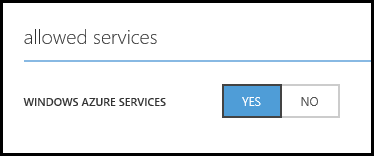

Django and SQL Database on Azure
================================

In this tutorial, we'll create a simple polls application using one of the 
PTVS sample templates.

We'll learn how to use a SQL database hosted on Azure, how to configure the 
application to use a SQL database, and how to publish the application to an 
Azure Website.

+ [Prerequisites](#prerequisites)
+ [Create the Project](#create-the-project)
+ [Create a SQL Database](#create-a-sql-database)
+ [Configure the Project](#configure-the-project)
+ [Publish to an Azure Website](#publish-to-an-azure-website)


## Prerequisites

 - Visual Studio 2012 or 2013
 - [PTVS 2.1](https://pytools.codeplex.com/releases/view/109707)
 - [PTVS 2.1 Samples VSIX](https://pytools.codeplex.com/releases/view/109707)
 - [Azure SDK Tools for VS 2013](http://go.microsoft.com/fwlink/p/?linkid=323510) or 
   [Azure SDK Tools for VS 2012](http://go.microsoft.com/fwlink/p/?linkid=323511)
 - [Python 2.7 32-bit](https://www.python.org/ftp/python/2.7.8/python-2.7.8.msi)


## Create the Project

In this section, we'll create a Visual Studio project using a sample template. 
We'll create a virtual environment and install required packages.  We'll create 
a local database using sqlite.  Then we'll run the application locally.

1. In Visual Studio, select **File**, **New Project**.

1. The project templates from the PTVS Samples VSIX are available under 
   **Python**, **Samples**.  Select **Polls Django Web Project** and click OK 
   to create the project.

  

1. You will be prompted to install external packages.  Select **Install into a 
   virtual environment**.

  

1. Select **Python 2.7** as the base interpreter.

  

1. Right-click the project node and select **Python**, **Django Sync DB**.

  

1. This will open a Django Management Console.  Follow the prompts to create a 
   user.

   This will create a sqlite database in the project folder.

  

1. Confirm that the application works by pressing <kbd>F5</kbd>.

1. Click **Log in** from the navigation bar at the top.

  

1. Enter the credentials for the user you created when you synchronized the 
   database.

  

1. Click **Create Sample Polls**.

  

1. Click on a poll and vote.

  


## Create a SQL Database

For the database, we'll create an Azure SQL database.

You can create a database by following these steps.

1. Log into the [Azure Management Portal](https://manage.windowsazure.com).

1. At the bottom of the navigation pane, click **NEW**.

  

1. Click **DATA SERVICES**, then **SQL DATABASE**, and then click **QUICK CREATE**.

  

1. Choose to create a New SQL database server.

1. Choose a Region/Affinity Group in which to locate the database. If you will 
   be using the database from your Azure application, select the same region 
   where you will deploy your application.


## Configure the Project

In this section, we'll configure our application to use the SQL database 
we just created.  We'll see how to obtain connection settings from the Azure 
portal.  We'll also install additional Python packages required to use SQL 
databases with Django.  Then we'll run the application locally.

1. In [Azure Management Portal](https://manage.windowsazure.com), click on 
   **SQL DATABASES**, then click on the database you created earlier.

1. Click **MANAGE**.

  

1. You will be prompted to update the firewall rules. Click **YES**.  This 
   will allow connections to the database server from your development machine.

  

1. Click on **SQL DATABASES**, then **SERVERS**.  Click on the server for your 
   database, then on **CONFIGURE**.

1. In this page, you'll see the IP address of every machine that is allowed to 
   connect to the database server.  You should see the IP address of your 
   machine.

   Below, under **allowed services**, make sure that Azure services are allowed 
   access to the server.  When the application is running in an Azure Website 
   (which we'll do in the next section of this tutorial), it will be allowed 
   to connect to the database.  Click **SAVE** to apply the change.

  

1. In Visual Studio, open **settings.py**, from the *ProjectName* folder.
   Edit the definition of `DATABASES`.

    ```python
    DATABASES = {
        'default': {
            'ENGINE': 'sql_server.pyodbc',
            'NAME': '<DatabaseName>',
            'USER': '<User>@<ServerName>',
            'PASSWORD': '<Password>',
            'HOST': '<ServerName>.database.windows.net',
            'PORT': '<ServerPort>',
            'OPTIONS': {
                'driver': 'SQL Server Native Client 11.0',
                'MARS_Connection': 'True',
            }
        }
    }
    ```

   `<DatabaseName>`, `<User>` and `<Password>` are the values you specified 
   when you created the database and server.

   The values for `<ServerName>` and `<ServerPort>` are generated by Azure 
   when the server is created, and can be found under the **Connect to your 
   database** section.

1. In Solution Explorer, under **Python Environments**, right-click on the 
   virtual environment and select **Install Python Package**.

1. Install the package `pyodbc` using **easy_install**.

  

1. Install the package `django-pyodbc-azure` using **pip**.

  

1. Right-click the project node and select **Python**, **Django Sync DB**.  

   This will create the tables for the SQL database we created in the 
   previous section.  Follow the prompts to create a user, which doesn't have 
   to match the user in the sqlite database created in the first section.

  

1. Run the application with <kbd>F5</kbd>.  Polls that are created with 
   **Create Sample Polls** and the data submitted by voting will be serialized 
   in the SQL database.


## Publish to an Azure Website

PTVS provides an easy way to deploy your web application to an Azure Website.

1. In **Solution Explorer**, right-click on the project node and select 
   **Publish**.

  

1. Click on **Microsoft Azure Websites**.

1. Click on **New** to create a new site.

1. Select a **Site name** and a **Region** and click **Create**.

  

1. Accept all other defaults and click **Publish**.

1. Your web browser will open automatically to the published site.  You should 
   see the application working as expected, using the **SQL** database 
   hosted on Azure.

   Congratulations!

  
